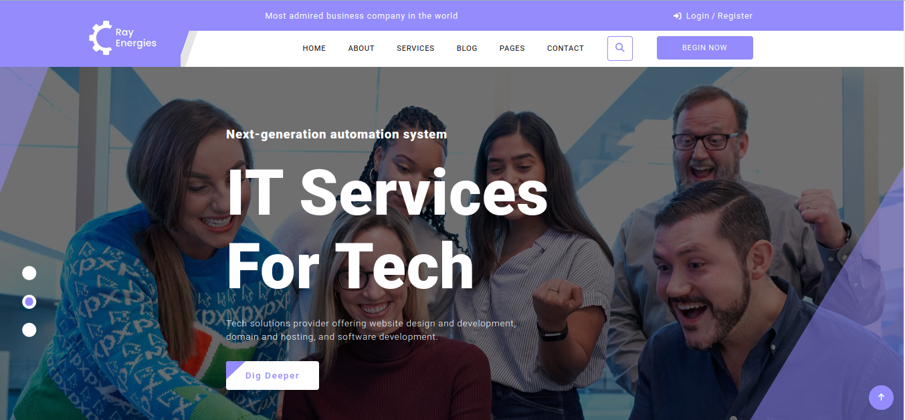
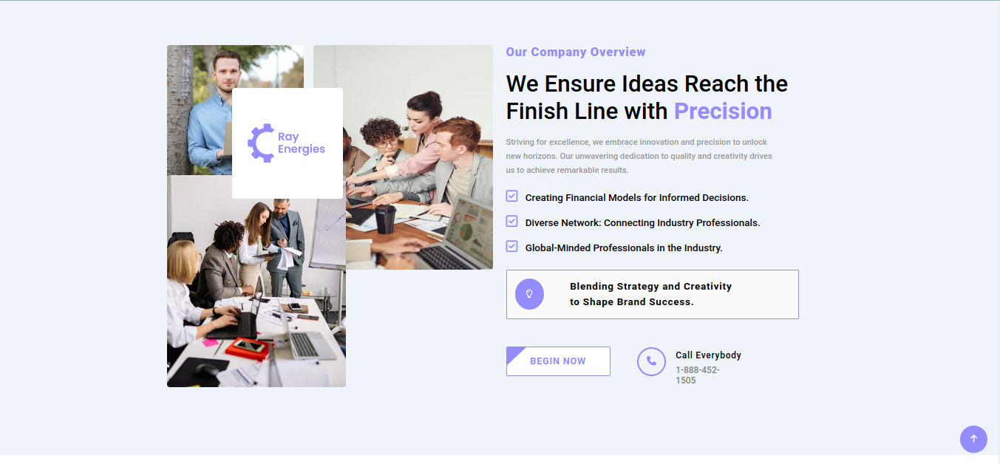
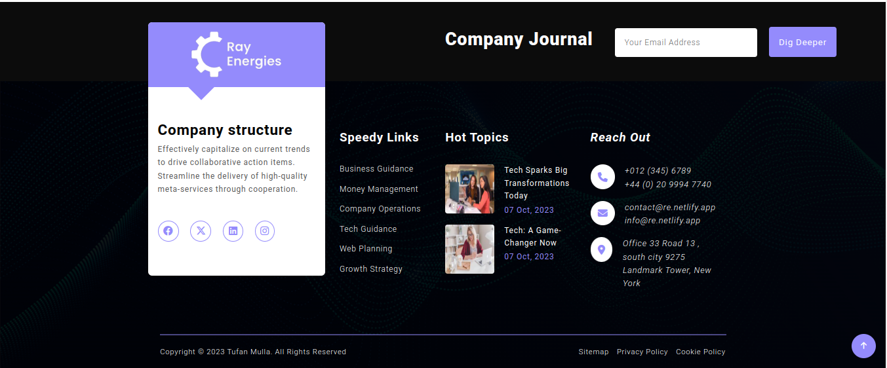

# RayEnergies - Empowering the Next Generation Automation

Welcome to the RayEnergies project, a website designed to showcase the future of automation, domain hosting, web development, and more. This project serves as a platform to implement and demonstrate our knowledge in web development and responsive design.

## Description

RayEnergies is a website dedicated to next-generation automation systems. It offers services such as domain hosting, web development, and more. This project is a result of our passion for web development and a desire to create a platform that showcases the future of automation.

Throughout the development of this project, we have gained valuable experience in building responsive web designs using media queries. This ensures that the website looks and functions well on various screen sizes, from desktop to mobile devices.

## Website URL

You can access the website here: [RayEnergies](https://rayenergies.netlify.app/)

## Sections

The website consists of several sections, including:

1. [Home](https://rayenergies.netlify.app/#)
2. [About Us](https://rayenergies.netlify.app/#about)
3. [Services](https://rayenergies.netlify.app/#services)
4. [Blog](https://rayenergies.netlify.app/#blog)
5. [Contact](https://rayenergies.netlify.app/#contact)

## Features

- Responsive design for various screen sizes.
- Showcase of next-generation automation services.
- Sample content to practice HTML and CSS.
- A platform for learning and showcasing web development skills.

## Technologies Used

- HTML
- CSS

## Usage

You can visit the website by clicking the link above. Explore the different sections to learn more about next-generation automation services and responsive web design.

## Screenshots

Include some screenshots or images:

## Author

- [Tufan Mulla](https://www.tufanmulla.com/)
- <tufanmulla@yahoo.com>

## License

This project is licensed under the MIT License - see the [LICENSE](LICENSE) file for details.

## Feedback and Contributions

If you have any feedback or would like to contribute to this project, please feel free to open an issue or a pull request.

## Acknowledgments

We would like to acknowledge the following resources, including the tutorials and inspiration that guided us in developing this project:

- [Anisul Islam's YouTube Channel](https://www.youtube.com/@anisul-islam): Anisul Islam's YouTube channel provided invaluable tutorials and lessons on web development, HTML, CSS, Git, and GitHub. Specific playlists that were particularly helpful include:

  - [HTML Tutorials](https://youtube.com/playlist?list=PLgH5QX0i9K3oHBr5dsumGwjUxByN5Lnw3&si=tvR-kyKSgasdg59N)
  - [CSS Tutorials](https://youtube.com/playlist?list=PLgH5QX0i9K3qjCBXjTmv7Xeh8MDUUVJDO&si=NS4YzG-CQEEXc0S9)
  - [Git and GitHub Tutorials](https://youtube.com/playlist?list=PLgH5QX0i9K3qAW8DT6I0XOxC23qnA4FL-&si=G-y9it1wMTrz2VvR)

These resources, especially Anisul Islam's YouTube channel, played a crucial role in enhancing our understanding of web development and were instrumental in completing this project.
